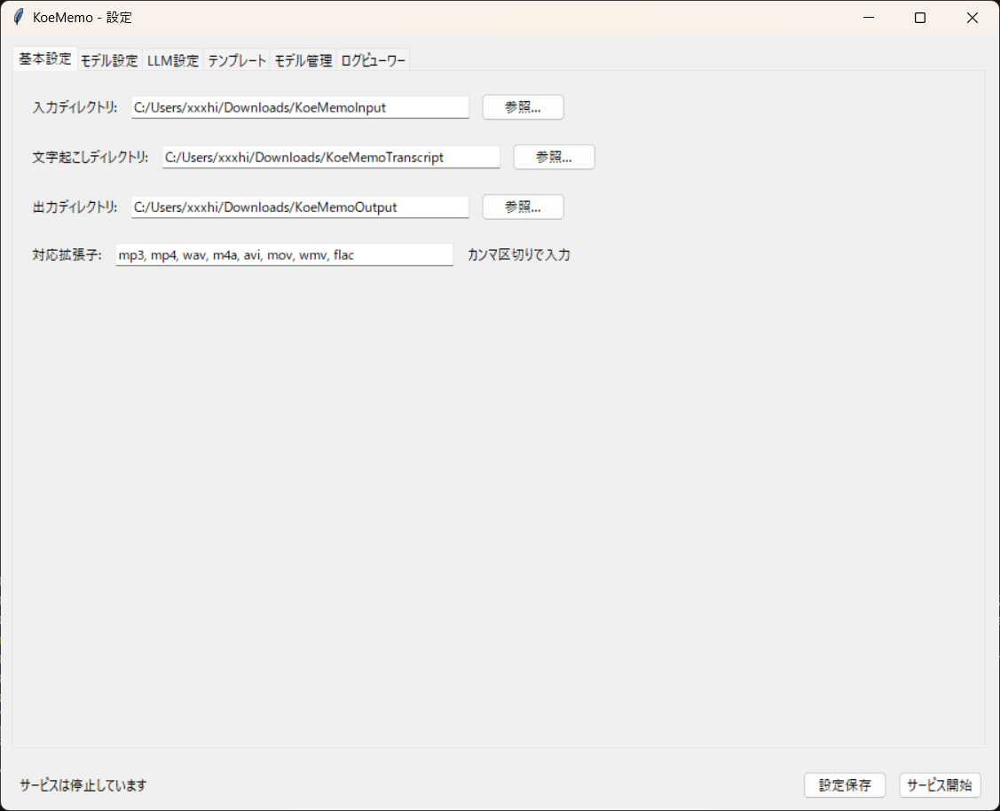
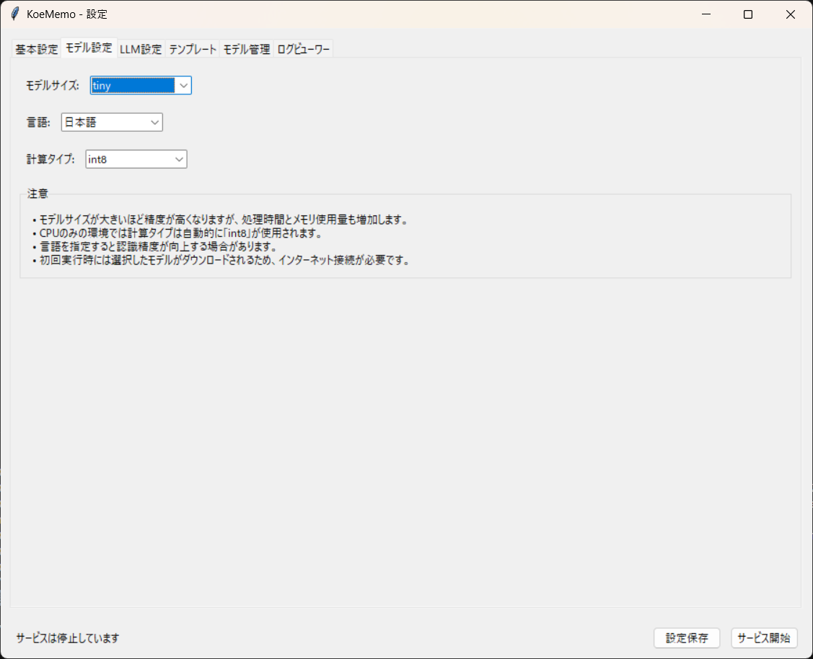
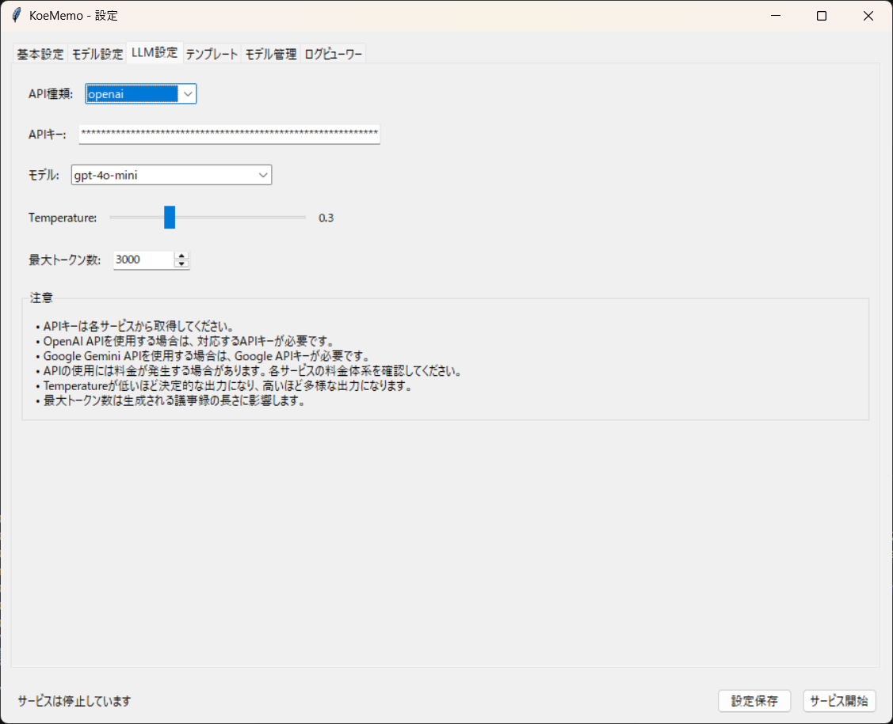
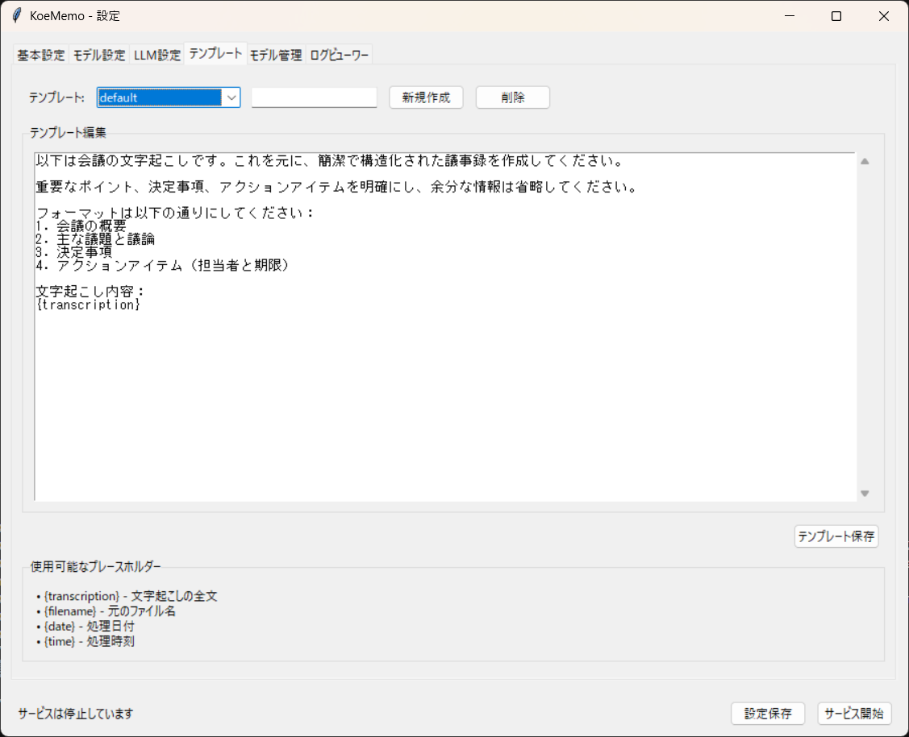
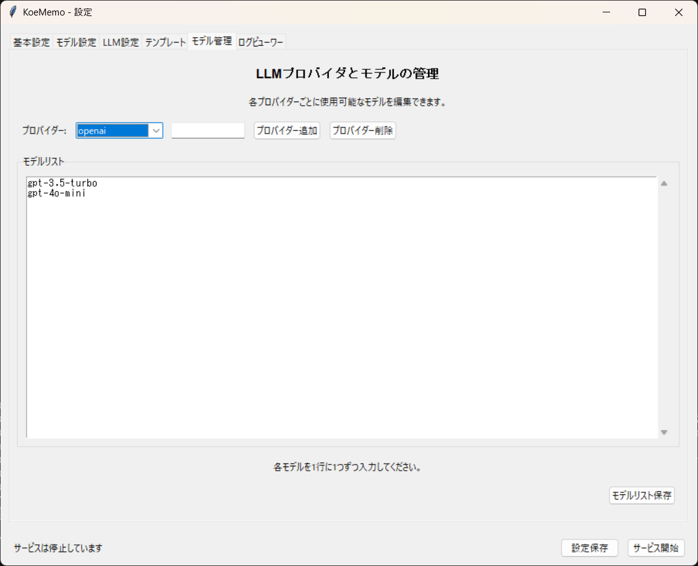
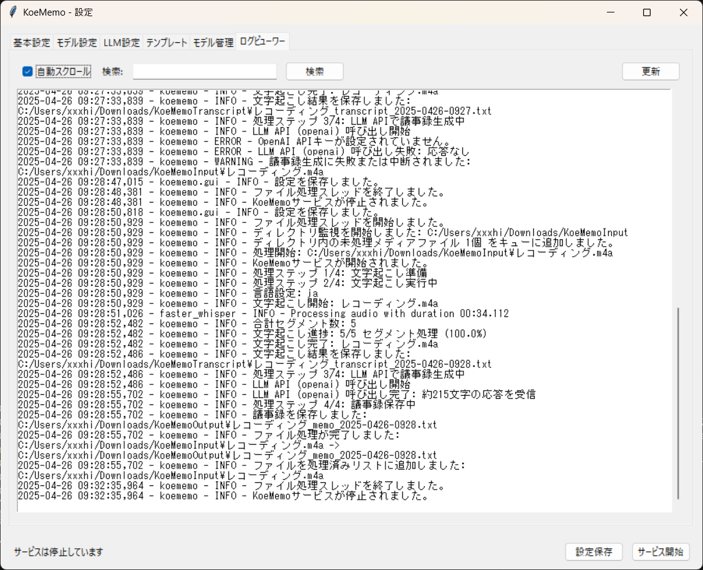

# KoeMemo プロジェクト

音声・動画ファイルから自動的に議事録を生成するシンプルなツール

## プロジェクト概要

KoeMemo（コエメモ）は、音声や動画ファイルから文字起こしを行い、LLM（大規模言語モデル）と連携して構造化された議事録を自動生成するツールです。Faster Whisperによる高品質な文字起こしとLLM APIを活用し、会議の記録作業を効率化します。

## 特徴

- **全自動処理**: 指定フォルダを監視し、新しいファイルを自動検出して処理
- **高品質文字起こし**: Faster Whisperモデルによる正確な文字起こし
- **AI議事録生成**: LLMを活用した構造化された議事録の自動作成
- **セグメント表示**: 文字起こし結果をタイムスタンプ付きセグメント単位で表示
- **文字起こし専用保存**: 生成された文字起こしテキストを専用ディレクトリに保存
- **最小限の設定**: シンプルなGUIで必要な設定のみを管理
- **バックグラウンド実行**: ユーザーの作業を妨げないサイレント動作

## ファイル構成

```
koememo/
├── main.py       # メインサービス（文字起こし、LLM連携、ファイル監視を含む）
├── gui.py        # 簡易設定GUI（各種タブビュー、ログ表示機能）
├── config.json   # 設定ファイル（プロンプトテンプレート、ディレクトリ設定、API設定等）
├── start.bat     # Windows用起動スクリプト
├── start.sh      # macOS/Linux用起動スクリプト
├── processed/    # 処理済みファイル履歴
├── logs/         # ログファイル（タイムスタンプ付きセグメント表示を含む）
├── images/       # スクリーンショット画像
├── docs/         # 詳細ドキュメント（GitHub Pages用）
│   ├── index.html           # メインドキュメントページ
│   ├── windows-setup.html   # Windows向けセットアップガイド
│   ├── macos-setup.html     # macOS向けセットアップガイド
│   ├── linux-setup.html     # Linux向けセットアップガイド
│   └── styles.css           # スタイルシート
└── README.md     # プロジェクト説明
```

## 必要環境

- Python 3.9以上（Python 3.11.3推奨）
- FFmpeg
- インターネット接続（初回のモデルダウンロードとLLM API連携用）

## 主な依存パッケージ

- `faster-whisper`: 音声文字起こし
- `requests`: LLM API連携
- `tkinter`: GUIインターフェース（最小限）
- `watchdog`: ファイル監視

## インストール方法

詳細なセットアップガイドが各OSごとに用意されています：

- [Windows セットアップガイド](docs/windows-setup.html)
- [macOS セットアップガイド](docs/macos-setup.html)
- [Linux セットアップガイド](docs/linux-setup.html)

または以下の基本手順に従ってください：

1. リポジトリをクローン：
   ```
   git clone https://github.com/infoHiroki/koememo.git
   ```

2. 必要なパッケージをインストール：
   ```
   pip install huggingface_hub
   pip install faster-whisper
   pip install openai anthropic google-generativeai requests pysimplegui pyaudio PyAV
   ```

3. FFmpegをインストール（システムによって方法が異なります）

4. 設定ファイルを準備：
   ```
   cp config.json.sample config.json
   ```

5. 設定ファイル（config.json）を編集：
   - 入力・出力ディレクトリを設定
   - LLM API情報を設定（APIキーを必ず設定してください）
   - 詳細は[API設定ガイド](API_SETUP.md)を参照してください

## 使用方法

### 初期設定
1. GUI設定画面を使用して各種設定を調整します
   - Windows: `start.bat`をダブルクリック
   - macOS/Linux: `./start.sh`を実行（実行権限がない場合は`chmod +x start.sh`で権限を付与）
2. 基本設定タブでディレクトリ設定とAPIキーを設定

### 通常使用
1. 次のいずれかの方法でKoeMemoを起動します：
   - GUI経由: `start.bat`または`start.sh`を実行
   - コマンドライン: `python gui.py`
2. GUI画面の「サービス開始」ボタンをクリックしてサービスを開始
3. 監視フォルダに音声・動画ファイルを追加するだけで自動処理
4. 処理完了後、出力フォルダに文字起こしテキストと議事録が生成されます

## プロンプトテンプレートのカスタマイズ

`config.json`内の`prompt_templates`セクションを編集することで、議事録のスタイルや内容をカスタマイズできます。テンプレート内の`{transcription}`は文字起こしテキストに置き換えられます。

## 注意事項

- 初回実行時はモデルのダウンロードが必要です
- LLM APIの使用には別途料金が発生する場合があります
- 長時間の音声ファイルは処理に時間がかかる場合があります

## セットアップサポート

セットアップサポートが必要な場合は有償にて行っています。お問い合わせは [info.hirokitakamura@gmail.com](mailto:info.hirokitakamura@gmail.com) までご連絡ください。

## ドキュメント

KoeMemoには詳細なドキュメントサイトが用意されています。以下のリンクからアクセスできます：

- [KoeMemo ドキュメントサイト](https://infoHiroki.github.io/koememo/)

ドキュメントサイトには以下の情報が含まれています：
- プロジェクトの概要と特徴
- 各OS（Windows、macOS、Linux）向けの詳細セットアップガイド
- 使用方法と設定ガイド
- スクリーンショットとサンプル

## 謝辞

このプロジェクトは以下のオープンソースプロジェクトやツールに支えられています：

- [Faster Whisper](https://github.com/guillaumekln/faster-whisper) - 高速で高精度な音声文字起こし
- [OpenAI API](https://openai.com/blog/openai-api) - 高品質なテキスト生成機能
- [Anthropic Claude API](https://anthropic.com) - AI対話モデル
- [Google Gemini API](https://ai.google.dev/) - 最新のAIテキスト生成
- すべてのコントリビューターとフィードバックを提供してくださったユーザーの皆様

## ライセンス

MITライセンス

## スクリーンショット

以下はアプリケーションの各画面のスクリーンショットです。

### スクリーンショット 1


### スクリーンショット 2


### スクリーンショット 3


### スクリーンショット 4


### スクリーンショット 5


### スクリーンショット 6

